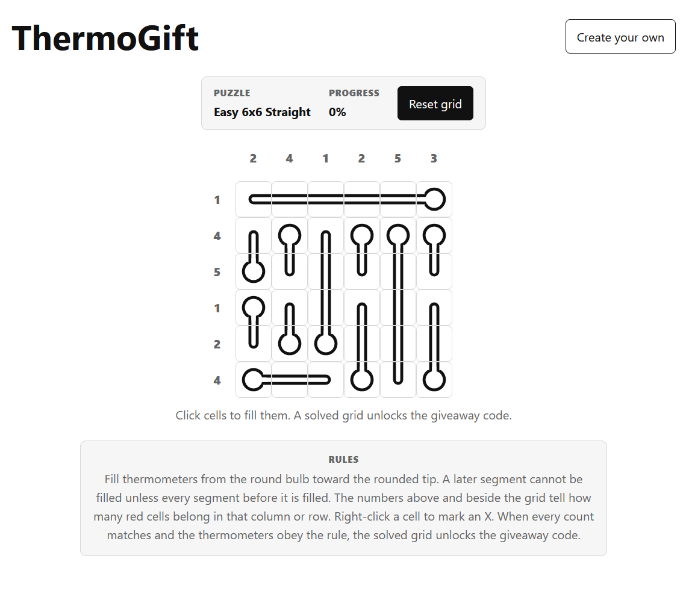

# ThermoGift

A thermometer-puzzle generator inspired by RosimInc's SteamGifts nonogram links.

The generator accepts a preset and a 5-character SteamGifts giveaway code. It creates a shareable URL in which the giveaway code is encrypted and decoded from the solved thermometer grid, so there is no server-side secret and no way to decrypt the giveaway code without solving the puzzle.



## Run

The app loads ES modules and spawns a Web Worker, so opening `index.html` directly will not work. From the project root, run either:

```
python3 -m http.server 8000
```

```
npx serve .
```

Then visit `http://localhost:8000` (or whichever port the server prints).

## Notes

- The current public URL format is `t1`; it stores the full puzzle inline (size, shape style, per-cell thermometer membership, fill lengths, the encrypted giveaway code, and a checksum) so no generator seed or server lookup is needed to load a link.
- The encryption key is derived from the solved grid, so the giveaway code can only be recovered by actually solving the puzzle.
- Presets currently range from 4x4 through 15x15, with curved or straight-only thermometer layouts.
- Each thermometer must be filled from bulb to tip.
- Row and column clues show how many cells must be filled.
- The app checks generated puzzles for a single row/column/thermometer solution before issuing a link.
